# 后端接口流程说明

本文档说明后端接口的内部处理链路，面向后端研发、联调人员和后续维护者。接口入参、返回字段和示例详见 `docs/API.md`；本文只描述后台流程、关键类方法和性能注意点。

## 1. 总体链路

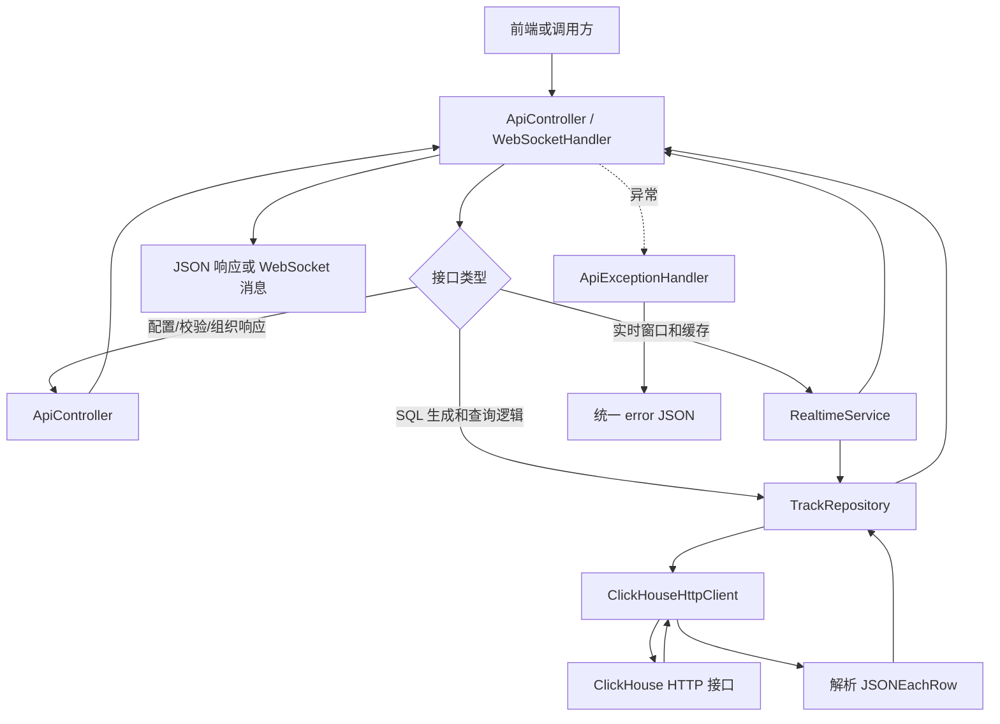

后台核心分工：

| 模块 | 职责 |
| --- | --- |
| `ApiController` | 接收 HTTP 请求，解析 query/body，校验时间窗口、bbox、zoom，调用服务或仓库并组织响应。 |
| `RealtimeService` | 推算实时窗口和全域窗口，维护实时最新船位缓存，读取数据库统计缓存。 |
| `TrackRepository` | 根据业务场景生成 ClickHouse SQL，处理抽稀、统计聚合、候选船查询。 |
| `TrackSimplificationService` | 旧 SED-RDP 抽稀任务，当前默认关闭；页面主链路使用 ClickHouse 固定抽稀表。 |
| `ClickHouseHttpClient` | 将 SQL 和参数通过 ClickHouse HTTP 接口发送，追加 `FORMAT JSONEachRow`，解析返回行；批量写入时使用 `INSERT ... FORMAT JSONEachRow`。 |
| `ApiExceptionHandler` | 捕获异常并返回统一 `{ "error": "..." }` JSON。 |

通用数据库查询流程：

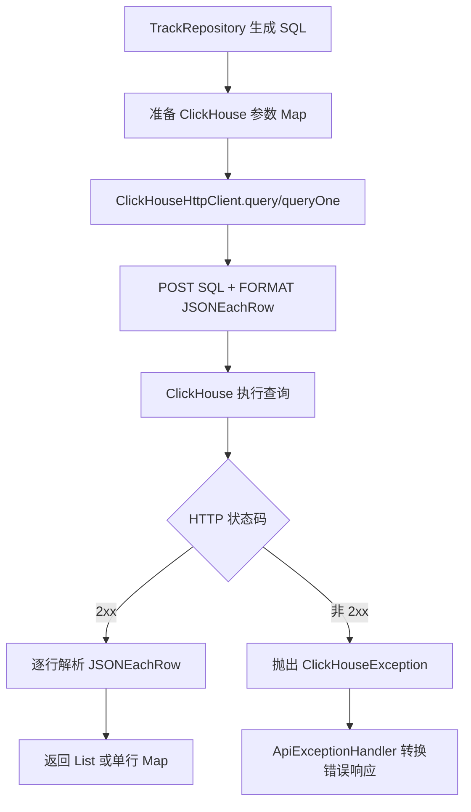

固定抽稀数据来源：

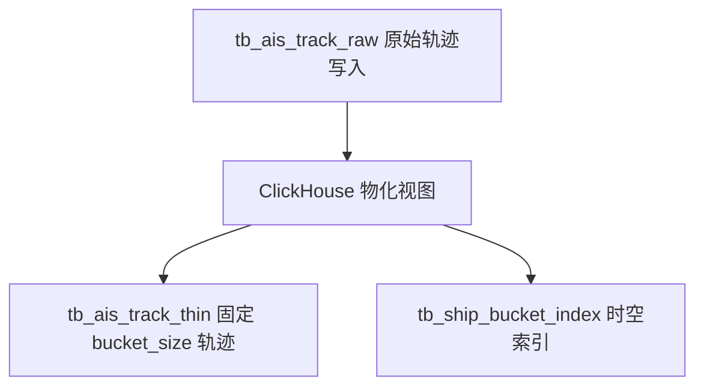

抽稀查询通用流程：

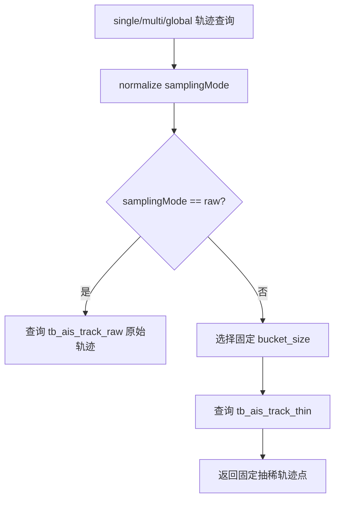

## 2. `GET /api/config/map`

后台职责：返回前端初始化需要的地图配置、查询上限和高德相关环境变量，不访问 ClickHouse。

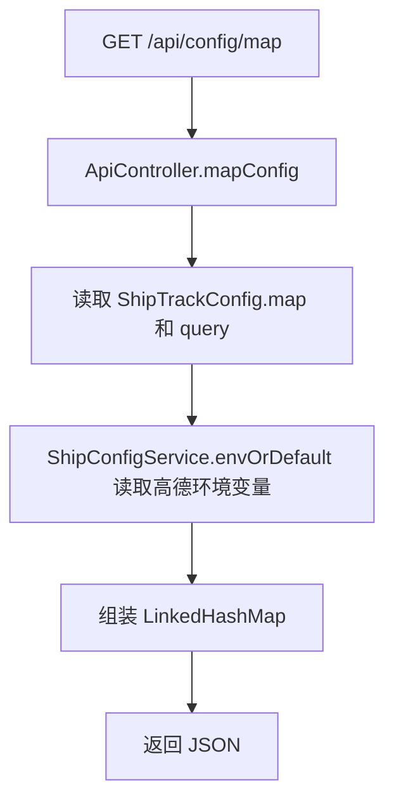

关键处理步骤：

1. `trace("/api/config/map", ...)` 开始记录请求耗时。
2. 从 `config.map` 读取 `coordinateSystem`、`defaultCenter`、`defaultZoom`。
3. 从 `config.query` 读取 `maxMultiShips`、`globalSegmentHours`。
4. 通过 `ShipConfigService.envOrDefault` 读取 `VITE_AMAP_KEY` 和 `VITE_AMAP_SECURITY_JS_CODE`。

主要参与类/方法：

| 类 | 方法 |
| --- | --- |
| `ApiController` | `mapConfig()` |
| `ShipConfigService` | `envOrDefault(...)` |

性能注意点或特殊逻辑：

- 该接口只读内存配置和环境变量，不产生数据库查询。
- 适合前端启动时调用一次，后续无需频繁请求。

## 3. `GET /api/realtime/latest`

后台职责：根据请求参数得到实时窗口，优先返回内存缓存中的最新船位；缓存未命中时刷新缓存，必要时回退到 ClickHouse 查询。

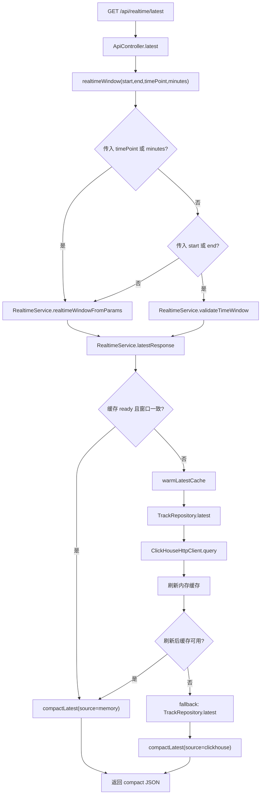

关键处理步骤：

1. `ApiController.realtimeWindow` 决定时间窗口来源。
2. `RealtimeService.realtimeWindowFromParams` 在未传 `timePoint` 时会调用 `TrackRepository.watermark()` 获取数据库最新时间。
3. `RealtimeService.latestResponse` 先检查内存缓存是否已就绪且窗口一致。
4. 缓存未命中时调用 `warmLatestCache`，内部使用 `TrackRepository.latest` 查询每艘船的最新点。
5. 返回紧凑结构：`fields` 描述字段顺序，`items` 是二维数组。

主要参与类/方法：

| 类 | 方法 |
| --- | --- |
| `ApiController` | `latest(...)`, `realtimeWindow(...)` |
| `RealtimeService` | `realtimeWindowFromParams(...)`, `validateTimeWindow(...)`, `latestResponse(...)`, `warmLatestCache(...)` |
| `TrackRepository` | `watermark()`, `latest(...)` |
| `ClickHouseHttpClient` | `query(...)`, `queryOne(...)` |

性能注意点或特殊逻辑：

- 这是实时态势核心接口，优先走内存缓存，减少 ClickHouse 压力。
- 缓存刷新会按 `query.realtimeCacheMaxShips` 限制加载规模。
- 未传时间窗口时需要先查 `watermark()`，这会产生一次轻量 ClickHouse 查询。

## 4. `GET /api/stats/realtime-summary`

后台职责：返回实时面板统计，包括全库统计、时间窗口统计、热力网格数量和视野内热力网格数量。

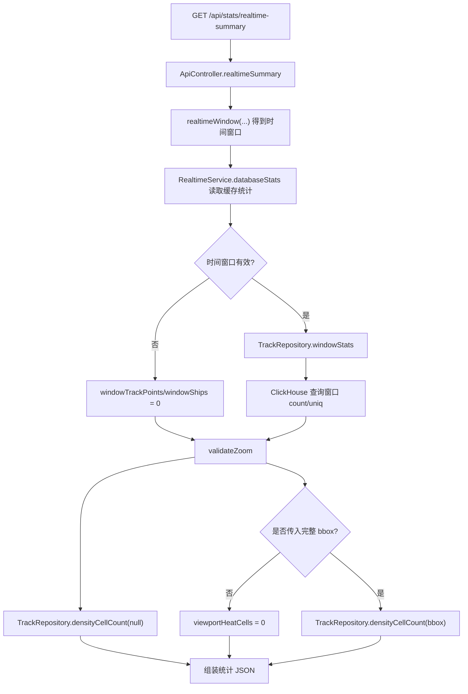

关键处理步骤：

1. 复用 `/api/realtime/latest` 的实时窗口解析规则。
2. `RealtimeService.databaseStats()` 返回启动预热后的全库统计缓存。
3. `TrackRepository.windowStats` 查询时间窗口内轨迹点和船舶数。
4. `TrackRepository.densityCellCount` 根据 `zoom` 推算网格大小并统计网格数量。

主要参与类/方法：

| 类 | 方法 |
| --- | --- |
| `ApiController` | `realtimeSummary(...)`, `bboxOrNull(...)` |
| `RealtimeService` | `databaseStats()`, `validateZoom(...)` |
| `TrackRepository` | `windowStats(...)`, `densityCellCount(...)` |

性能注意点或特殊逻辑：

- 最多可能触发 3 次 ClickHouse 查询：窗口统计、全窗口热力格数、视野热力格数。
- 未传 bbox 时不会查询视野热力格数，直接返回 `viewportHeatCells=0`。
- 全库统计来自内存缓存，不在该接口内重新扫描全库。

## 5. `GET /api/stats/database`

后台职责：返回全库轨迹点数量和船舶数量。当前 HTTP 接口读取 `RealtimeService` 中的统计缓存。

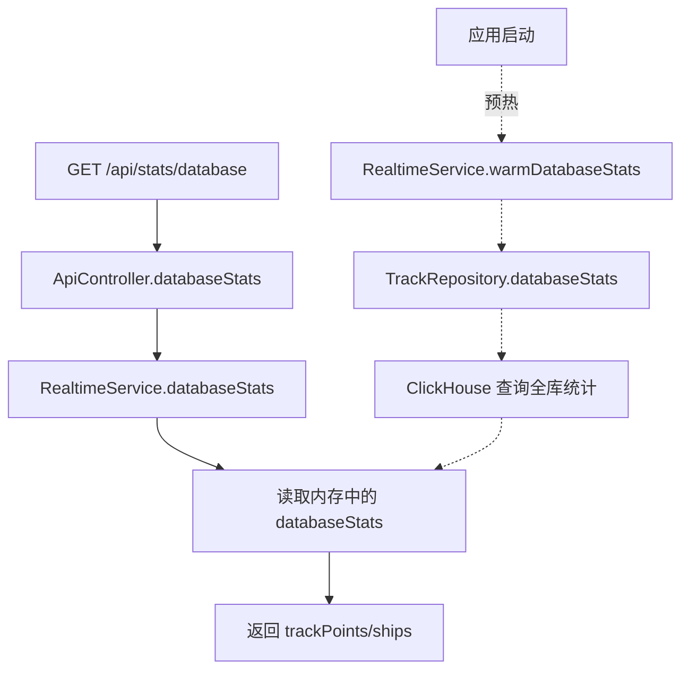

关键处理步骤：

1. 应用启动时 `RealtimeService.warmOnStartup` 会调用 `warmDatabaseStats`。
2. `warmDatabaseStats` 通过 `TrackRepository.databaseStats` 查询全库 `count()` 和 `uniqCombined64(shipId)`。
3. HTTP 请求到达时直接返回内存中的 `databaseStats`。

主要参与类/方法：

| 类 | 方法 |
| --- | --- |
| `ApiController` | `databaseStats()` |
| `RealtimeService` | `databaseStats()`, `warmOnStartup()`, `warmDatabaseStats()` |
| `TrackRepository` | `databaseStats()` |

性能注意点或特殊逻辑：

- 接口本身不直接查 ClickHouse，速度取决于内存读取。
- 如果启动预热失败，缓存默认值为 `trackPoints=0`、`ships=0`，日志会记录失败原因。

## 6. `GET /api/stats/global-summary`

后台职责：根据全域回放窗口返回窗口内轨迹点数量，同时返回全库统计缓存。

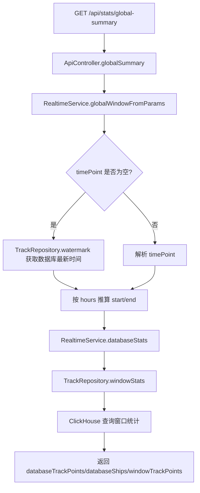

关键处理步骤：

1. `globalWindowFromParams` 使用 `timePoint` 作为结束时间。
2. 未传 `timePoint` 时调用 `TrackRepository.watermark()` 获取数据库最大事件时间。
3. `hours` 为空时使用配置 `query.globalSegmentHours`。
4. 只返回窗口轨迹点数量，不返回窗口船舶数。

主要参与类/方法：

| 类 | 方法 |
| --- | --- |
| `ApiController` | `globalSummary(...)` |
| `RealtimeService` | `globalWindowFromParams(...)`, `databaseStats()` |
| `TrackRepository` | `watermark()`, `windowStats(...)` |

性能注意点或特殊逻辑：

- 未传 `timePoint` 会多一次 `watermark()` 查询。
- `windowStats` 会统计窗口内轨迹点和船舶数，但响应只使用 `trackPoints`。

## 7. `GET /api/stats/multi-summary`

后台职责：返回多船模式下时间窗口全范围统计，以及可选 bbox 范围内统计。

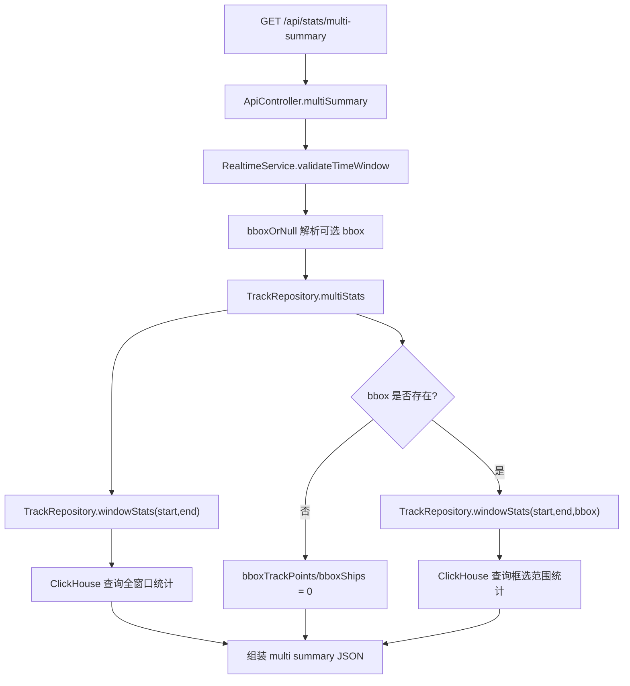

关键处理步骤：

1. 强制校验 `start` 和 `end`，时间窗口无效时抛出异常。
2. bbox 参数不完整时视为未传 bbox。
3. `multiStats` 总是查询全窗口统计；只有存在 bbox 时才额外查询框选范围统计。

主要参与类/方法：

| 类 | 方法 |
| --- | --- |
| `ApiController` | `multiSummary(...)`, `bboxOrNull(...)` |
| `RealtimeService` | `validateTimeWindow(...)` |
| `TrackRepository` | `multiStats(...)`, `windowStats(...)` |

性能注意点或特殊逻辑：

- 传入 bbox 时会有 2 次窗口统计查询。
- 未传 bbox 时框选指标直接为 0，避免无意义查询。

## 8. `GET /api/stats/single-track-points`

后台职责：统计单船在时间窗口内的原始轨迹点数量。

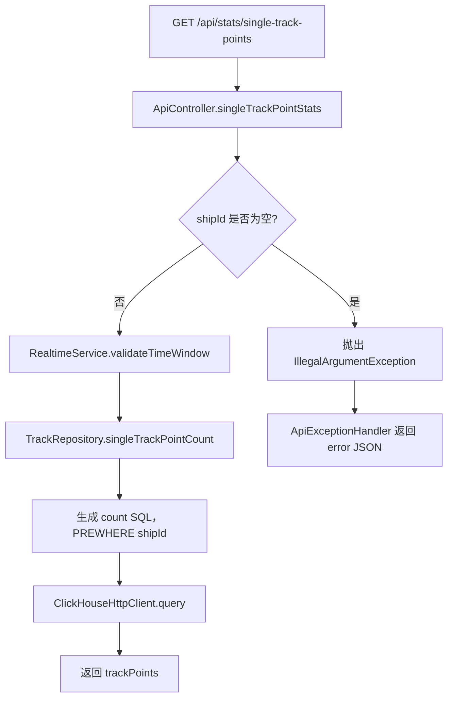

关键处理步骤：

1. `shipId` 为空直接抛出参数异常。
2. 时间窗口通过 `validateTimeWindow` 校验。
3. `singleTrackPointCount` 生成 `count()` SQL，并使用 `PREWHERE shipId` 加速单船过滤。

主要参与类/方法：

| 类 | 方法 |
| --- | --- |
| `ApiController` | `singleTrackPointStats(...)` |
| `RealtimeService` | `validateTimeWindow(...)` |
| `TrackRepository` | `singleTrackPointCount(...)` |

性能注意点或特殊逻辑：

- 该接口只返回数量，不返回轨迹点。
- SQL 使用单船过滤，适合配合单船抽稀轨迹展示原始点总量。

## 9. `POST /api/stats/multi-track-points`

后台职责：统计多艘船在时间窗口内的原始轨迹点总数。

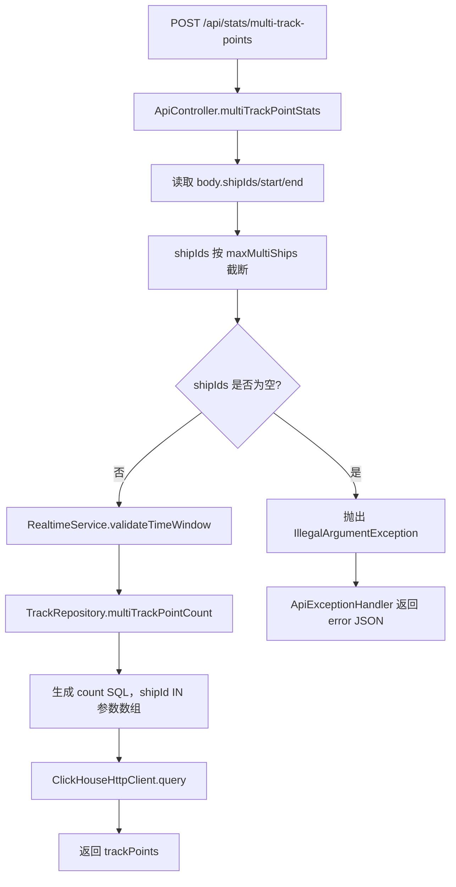

关键处理步骤：

1. 请求体中的 `shipIds` 最多保留 `config.query.maxMultiShips` 个。
2. `shipIds` 为空时直接抛出参数异常。
3. `multiTrackPointCount` 使用 `shipId IN {shipIds: Array(String)}` 查询总点数。

主要参与类/方法：

| 类 | 方法 |
| --- | --- |
| `ApiController` | `multiTrackPointStats(...)` |
| `RealtimeService` | `validateTimeWindow(...)` |
| `TrackRepository` | `multiTrackPointCount(...)` |

性能注意点或特殊逻辑：

- 只做计数，不返回轨迹明细。
- 多船数量受 `maxMultiShips` 限制，避免超大 IN 列表拖慢查询。

## 10. `GET /api/analysis/density`

后台职责：按时间窗口、bbox 和地图缩放级别聚合单帧密度网格；态势分析由前端按时间片逐帧请求。

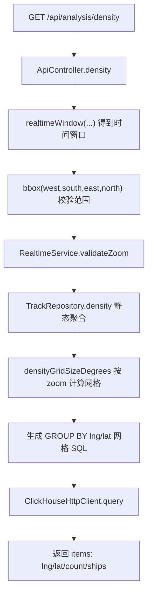

关键处理步骤：

1. 时间窗口规则与实时接口一致。
2. bbox 是必填参数，缺失或范围非法会抛出异常。
3. `densityGridSizeDegrees` 根据 `zoom` 返回网格粒度。
4. SQL 只按网格中心点聚合 `count()` 和 `uniqCombined64(shipId)`。
5. 前端如果要播放多帧热力，按自己的时间步进逐帧请求该接口。

主要参与类/方法：

| 类 | 方法 |
| --- | --- |
| `ApiController` | `density(...)`, `realtimeWindow(...)`, `bbox(...)` |
| `RealtimeService` | `validateZoom(...)` |
| `TrackRepository` | `density(...)`, `densityGridSizeDegrees(...)` |

性能注意点或特殊逻辑：

- bbox 必填，避免全域热力查询影响船只加载速度。
- 态势分析播放由前端串行请求控制，后端只负责返回当前时间片的静态热力点。
- 返回数量受 `query.maxDensityCells` 限制。

## 11. `GET /api/tracks/single`

后台职责：查询单船轨迹，支持原始点和抽稀点返回。`raw` 查询原始表；`auto/manual` 查询固定抽稀表。

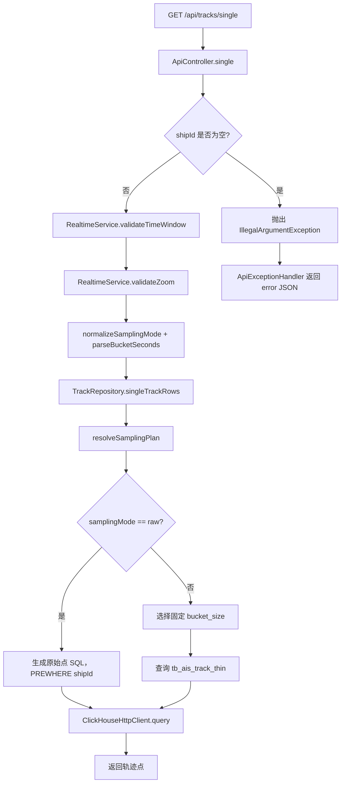

关键处理步骤：

1. `shipId` 为空直接抛出异常。
2. 时间窗口必须合法，`zoom` 必须在 3 到 18。
3. `samplingMode` 非法时归一化为 `auto`。
4. `raw` 模式返回原始轨迹点；`auto/manual` 模式查询 `bucket_size=60/300/1800` 的固定抽稀点。

主要参与类/方法：

| 类 | 方法 |
| --- | --- |
| `ApiController` | `single(...)`, `normalizeSamplingMode(...)`, `parseBucketSeconds(...)` |
| `RealtimeService` | `validateTimeWindow(...)`, `validateZoom(...)` |
| `TrackRepository` | `singleTrackRows(...)`, `bucketSizeForZoom(...)`, `resolveSamplingPlan(...)` |

性能注意点或特殊逻辑：

- 默认使用 `auto` 抽稀，目标是控制单船返回点数。
- `raw` 模式可能返回大量点，应只用于需要原始明细的场景。
- 单船 SQL 使用 `PREWHERE shipId`。
- 默认抽稀路径避免从原始表再做 bucket 聚合，控制船只加载查询成本。

## 12. `GET /api/tracks/candidates`

后台职责：查询多船框选范围内的候选船舶列表，用于先筛船再查询多船轨迹。

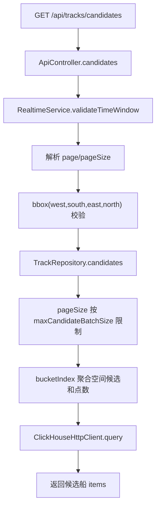

关键处理步骤：

1. 强制校验时间窗口和 bbox。
2. `page` 默认 1，`pageSize` 默认 100，并受配置上限限制。
3. 空间候选和点数查询只使用 `config.tables.bucketIndex` 配置的桶索引表。
4. 候选阶段不补船型，避免为了候选列表额外读取轨迹表；已选船轨迹查询再返回船型字段。

主要参与类/方法：

| 类 | 方法 |
| --- | --- |
| `ApiController` | `candidates(...)`, `bbox(...)` |
| `RealtimeService` | `validateTimeWindow(...)` |
| `TrackRepository` | `candidates(...)` |

性能注意点或特殊逻辑：

- 该接口使用桶索引表而不是原始轨迹表，目的是加快候选船加载。
- 返回按 AIS 优先、点数倒序、船舶编号升序排序。
- `pageSize` 受 `query.maxCandidateBatchSize` 限制，默认最大 1000。

## 13. `POST /api/tracks/multi`

后台职责：查询多艘船轨迹，支持原始点和抽稀点返回。`raw` 查询原始表；`auto/manual` 查询固定抽稀表。

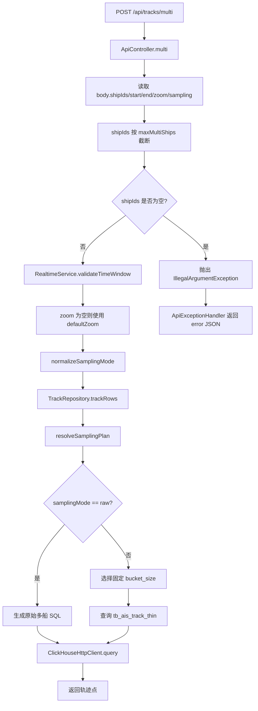

关键处理步骤：

1. `shipIds` 最多保留 `config.query.maxMultiShips` 个。
2. `zoom` 为空时使用 `config.map.defaultZoom`；当前该接口未调用 `validateZoom`。
3. `TrackRepository.trackRows` 根据抽稀计划生成原始 SQL 或固定抽稀表 SQL。
4. 请求体类中存在 `bbox` 字段，但当前控制器传给仓库的是 `null`，因此该接口实际不按 bbox 过滤。

主要参与类/方法：

| 类 | 方法 |
| --- | --- |
| `ApiController` | `multi(...)`, `normalizeSamplingMode(...)` |
| `RealtimeService` | `validateTimeWindow(...)` |
| `TrackRepository` | `trackRows(...)`, `resolveSamplingPlan(...)`, `bucketSizeForZoom(...)` |

性能注意点或特殊逻辑：

- 多船查询是重接口，默认应使用 `auto` 抽稀。
- 船舶数量受 `maxMultiShips` 限制，避免超大查询影响加载速度。
- 建议先用 `/api/tracks/candidates` 筛选船舶，再调用该接口。
- 前端使用返回点作为播放事件源，但地图只绘制当前播放时刻向前 30 分钟的轨迹窗口，不再预画整段轨迹。

## 14. `GET /api/tracks/global-segment`

后台职责：查询全域回放时间片段内的抽稀位置帧。全域回放固定留在抽稀表链路，传入 `raw` 也不扫描原始表。

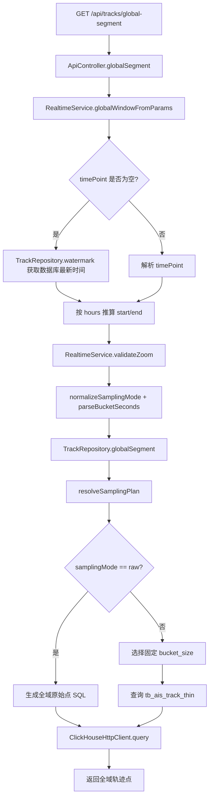

关键处理步骤：

1. `timePoint` 为空时通过 `watermark()` 取数据库最大时间。
2. `hours` 为空时使用配置 `query.globalSegmentHours`。
3. `globalSegment` 在 `auto/manual` 下按 zoom 选择固定抽稀粒度。
4. 返回多艘船的轨迹点，按时间和船舶编号排序。

主要参与类/方法：

| 类 | 方法 |
| --- | --- |
| `ApiController` | `globalSegment(...)`, `normalizeSamplingMode(...)`, `parseBucketSeconds(...)` |
| `RealtimeService` | `globalWindowFromParams(...)`, `validateZoom(...)` |
| `TrackRepository` | `watermark()`, `globalSegment(...)`, `resolveSamplingPlan(...)` |

性能注意点或特殊逻辑：

- 全域查询覆盖范围最大，应优先使用 `auto` 抽稀。
- `raw` 模式可能返回巨大数据量，容易影响船只加载和前端渲染。
- 前端全域回放只显示每艘船当前播放时刻的位置 marker，不绘制轨迹线。

## 15. `GET /ws/realtime`

后台职责：建立实时 WebSocket 连接，并在连接建立后发送一次当前缓存状态。

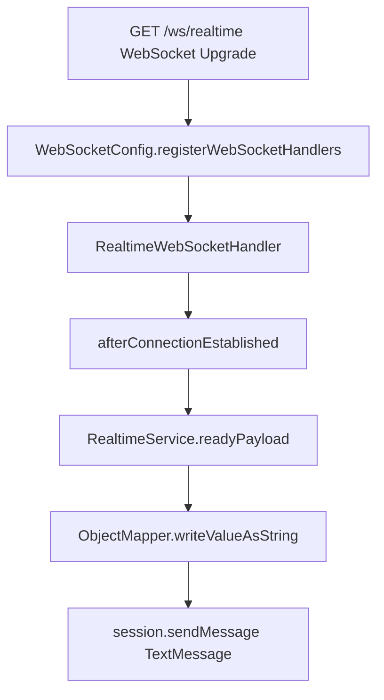

关键处理步骤：

1. `WebSocketConfig` 将 `/ws/realtime` 注册到 `RealtimeWebSocketHandler`。
2. 客户端连接建立后触发 `afterConnectionEstablished`。
3. 处理器调用 `RealtimeService.readyPayload()` 获取当前缓存状态。
4. 通过 `ObjectMapper` 序列化为 JSON，并发送给客户端。

主要参与类/方法：

| 类 | 方法 |
| --- | --- |
| `WebSocketConfig` | `registerWebSocketHandlers(...)` |
| `RealtimeWebSocketHandler` | `afterConnectionEstablished(...)` |
| `RealtimeService` | `readyPayload()` |

性能注意点或特殊逻辑：

- 当前实现只在连接建立后发送一次 ready 消息。
- 该流程不直接查询 ClickHouse。

## 16. 异常处理流程

后台职责：将控制器、服务层、仓库层和 ClickHouse 客户端抛出的异常统一转换为 JSON 错误响应。

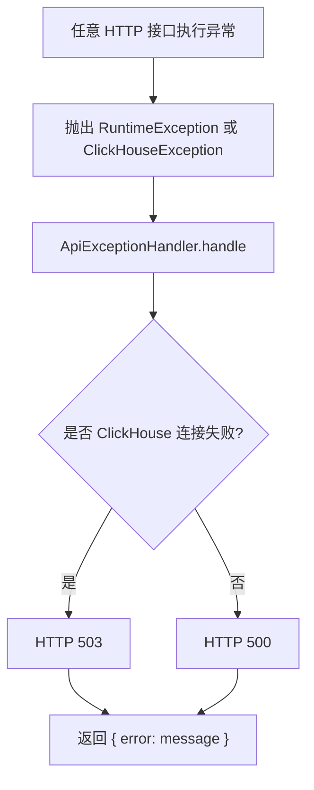

关键处理步骤：

1. 参数校验失败通常抛出 `IllegalArgumentException`。
2. ClickHouse 查询失败抛出 `ClickHouseException`。
3. 如果错误信息包含 `ClickHouse connection failed`，返回 HTTP 503。
4. 其他异常返回 HTTP 500。

主要参与类/方法：

| 类 | 方法 |
| --- | --- |
| `ApiExceptionHandler` | `handle(Exception error)` |
| `ClickHouseHttpClient` | `post(...)` |

性能注意点或特殊逻辑：

- 异常处理本身不做重试。
- ClickHouse 连接失败会在日志中记录 endpoint、timeout 和 max execution time。
